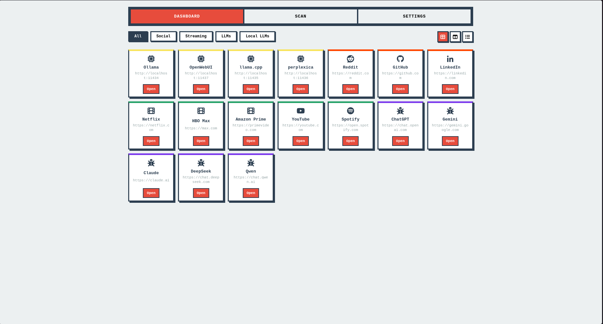
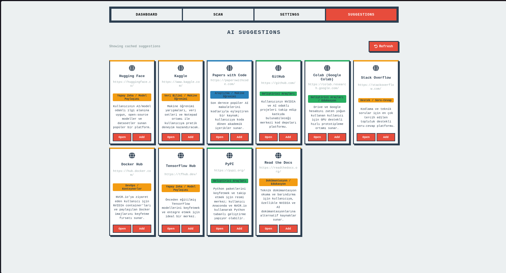
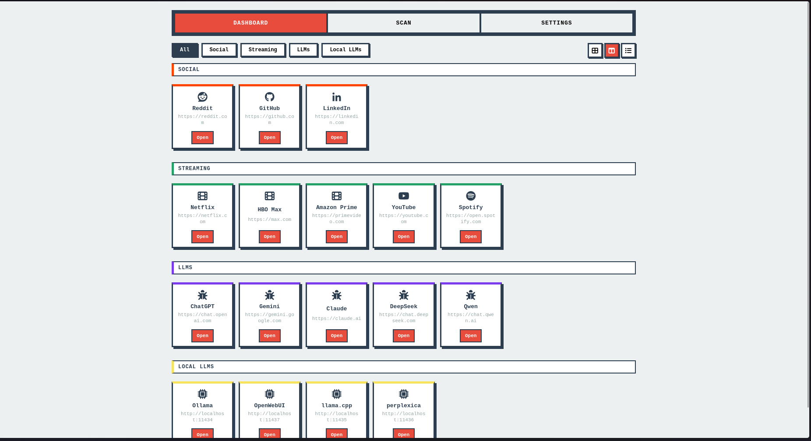
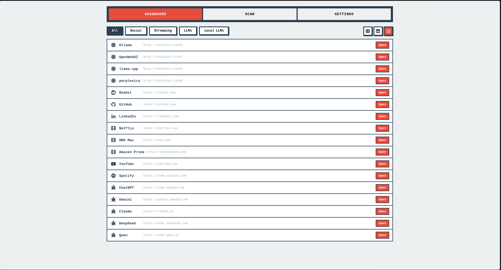
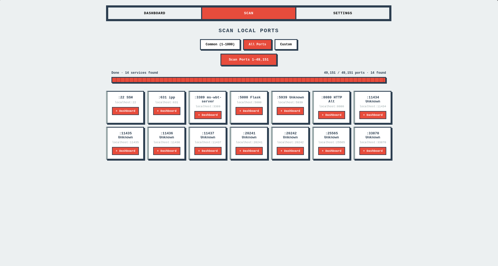
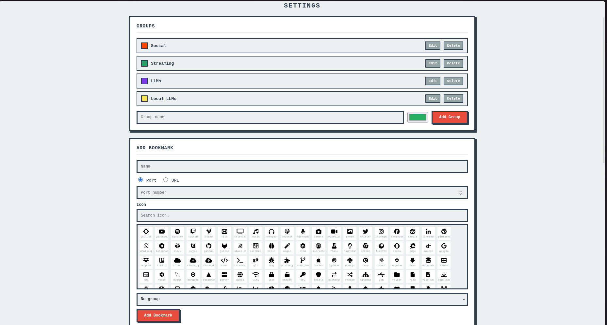

# Pixel Art Launcher

A self-hosted bookmark dashboard with a pixel-art aesthetic. Organise your local services and favourite URLs into groups, discover running services by scanning localhost ports, and launch everything from one place.



---

## Features

- **Three dashboard views** — Grid, Grouped (bookmarks under section headers), and List — switchable with one click and remembered across sessions
- **Drag-and-drop reordering** — rearrange bookmarks in grid and grouped views; order persists to disk
- **Groups** — colour-coded categories with filter pills on the dashboard
- **Port scanner** — scans localhost port ranges in parallel and lets you add discovered services directly to the dashboard
- **Nerd Font icons** — 147 icons searchable by name, rendered via Nerd Fonts Symbols
- **Persistent storage** — everything saved to a local JSON file; no database required
- **Docker-first** — single `docker-compose up --build` to run
- **AI Suggestions** — Get bookmark recommendations based on your Firefox browsing history (Python backend + LLM)

---

## Screenshots

### AI Suggestions Tab


### Dashboard — Grouped View


### Dashboard — List View


### Port Scanner


### Settings


---

## AI Suggestions (Firefox History Integration)

The **Suggestions** tab uses your Firefox browsing history to generate personalized bookmark recommendations via an LLM (llama.cpp or any OpenAI-compatible API).

### Requirements
- Firefox or Zen Browser installed
- Python 3.8+
- `requests` library (`pip install requests`)
- LLM endpoint running (e.g., llama.cpp on port 8080 or any OpenAI-compatible API)

### Setup

1. **Start the Python backend:**
   ```bash
   # Linux/macOS
   ./start_suggestions.sh
   
   # Windows
   start_suggestions.bat
   ```

2. **Configure the LLM endpoint (optional):**
   By default, the backend looks for an OpenAI-compatible API at `http://localhost:7421/v1/chat/completions`. You can override this with environment variables:
   ```bash
   export LLM_ENDPOINT="http://localhost:8080/v1/chat/completions"
   export LLM_MODEL="llama.cpp"
   ./start_suggestions.sh
   ```

3. **Access Suggestions tab:** Open the app and click **Suggestions** in the navigation.

### How It Works
1. Reads Firefox history from `places.sqlite` (creates a temporary copy to avoid locking)
2. Extracts top 30 visited domains
3. Sends domain list to LLM with a prompt asking for 10 relevant site suggestions
4. Caches results for 1 hour to avoid repeated API calls
5. Displays suggestions as clickable cards with "Open" and "Add to Dashboard" buttons

### Troubleshooting

**"Firefox profile not found"** - Make sure Firefox or Zen Browser has been used before. The backend searches for:
- Linux: `~/.zen/*/places.sqlite` or `~/.mozilla/firefox/*/places.sqlite`

**Backend not responding** - Check the log file at `/tmp/suggestions_backend.log`

**LLM not returning suggestions** - Ensure your LLM endpoint is running and accessible. Test with:
```bash
curl http://localhost:8080/v1/chat/completions -X POST -H "Content-Type: application/json" -d '{"model": "llama.cpp", "messages": [{"role": "user", "content": "test"}]}'
```

---

## Quick Start

**With Docker (recommended):**

```bash
git clone https://github.com/ikaganacar1/Custom_Bookmark_Page.git
cd Custom_Bookmark_Page
docker-compose up --build
```

Open [http://localhost:5000](http://localhost:5000).

Bookmark data is stored in `./data/favorites.json` and mounted into the container, so it survives rebuilds.

**Without Docker:**

```bash
pip install flask
python app.py
```

---

## Usage

| Tab | What it does |
|---|---|
| **Dashboard** | Launch bookmarks. Filter by group, switch view mode, drag to reorder. |
| **Scan** | Scan a port range on localhost. Click `+ Dashboard` to save a discovered service. |
| **Settings** | Create/edit groups and bookmarks. Choose a port number or a full URL, pick an icon. |
| **Suggestions** | AI-powered bookmark recommendations based on Firefox history. |

---

## Tech Stack

- **Backend** — Python 3.11 + Flask
- **Frontend** — Vanilla HTML / CSS / JavaScript (no frameworks)
- **Storage** — `data/favorites.json`
- **Icons** — [Nerd Fonts Symbols Only](https://github.com/ryanoasis/nerd-fonts)
- **Deployment** — Docker + Docker Compose (`network_mode: host` for localhost access)
